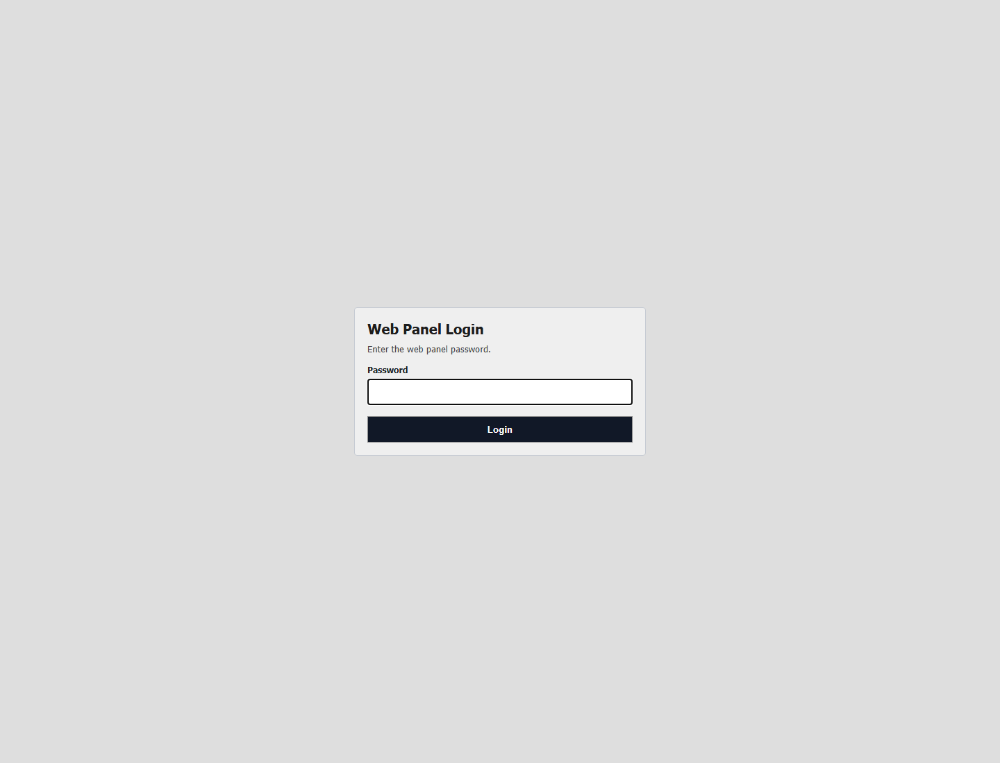
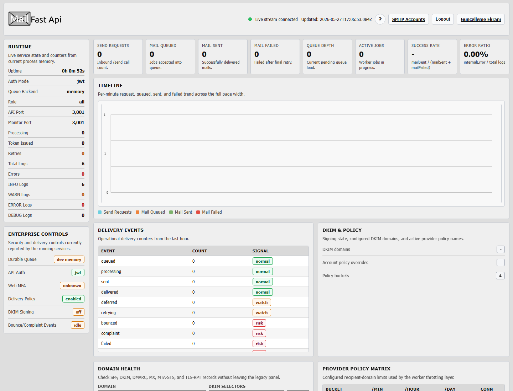
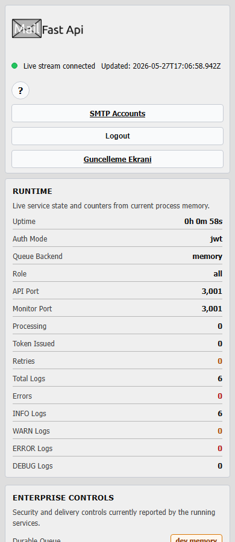
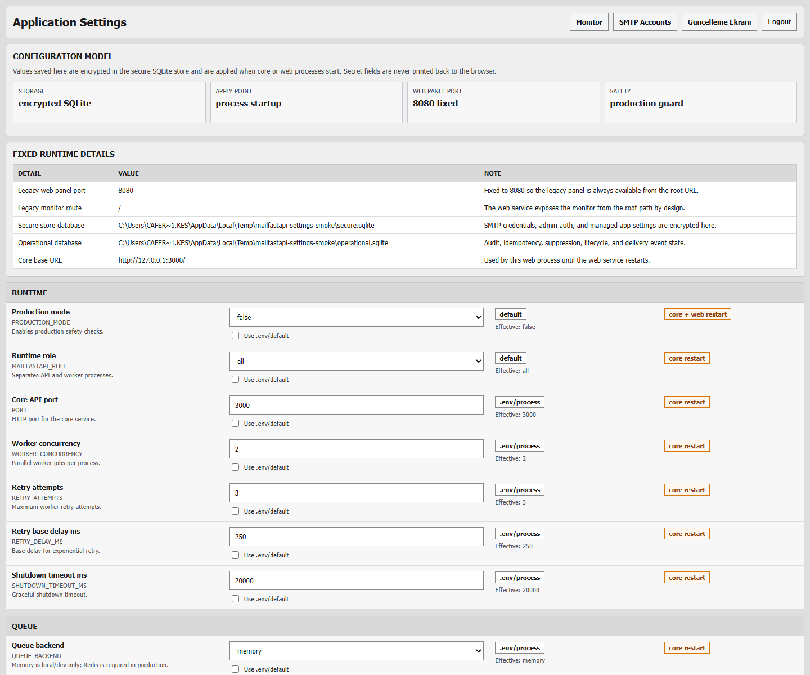

# mailFastApi

High-performance Node.js email microservice with split core/web architecture.

GPLv3 community release: this project is licensed under the GNU General Public License v3.0.
The goal is to provide an open, inspectable mail queueing, caching, delivery, and operations
platform that the community can run, study, fork, and improve.

Core design:

- Incoming email requests are validated, checked for idempotency/suppression, and written to Redis queue immediately.
- Worker processes consume leased Redis jobs and deliver via pooled SMTP accounts.
- System logs are persisted to SQLite and file logs simultaneously.
- Monitor web panel is served by a separate web service.
- SMTP credentials and web admin password verifier are stored in an encrypted SQLite vault.

## Architecture

```text
Client -> Core API (/send, /auth/token, /health) -> Queue -> Worker -> SMTP Provider
                                     \-> Structured Logger -> SQLite + File + Console
Web Panel Service (:8080 root) -> Core Monitor APIs (/monitor/stats, /monitor/stream, /metrics)
                 -> SMTP Account Manager + Secure Update Control (scripts/updater.js)
```

## Web Panel Preview

The legacy web panel is served directly from the root of port `8080`.
Screenshots below were captured from a local development run on 2026-05-27.

### Secure Web Login



### Legacy Monitor - Desktop



### Legacy Monitor - Mobile



### Encrypted Application Settings



## Key Features

- Fast ACK pattern (`202 queued`) without waiting SMTP round-trip
- Redis-backed mail queue (`QUEUE_BACKEND=redis`) with processing leases, visibility timeout, and ack
- API/worker role split with `MAILFASTAPI_ROLE=api|worker|all`
- Production safety guard with `PRODUCTION_MODE=true`
- Idempotency records, lifecycle states, suppression list, delivery events, dead-letter jobs, and hash-chained audit events in operational SQLite
- Domain/account delivery policies for Gmail, Outlook, Yahoo, and corporate mail systems
- Bounce classifier plus protected hard-bounce and complaint webhook ingestion
- One-click unsubscribe support for marketing/bulk mail
- Dedicated Return-Path generation and optional DKIM signing
- SPF/DKIM/DMARC/MX/MTA-STS/TLS-RPT domain health diagnostics on the monitor API
- Cached Nodemailer pooled transporters per SMTP account
- Encrypted SMTP account vault (`data/mailfastapi-secure.sqlite`) protected by `SECURE_STORE_KEY`
- First-run web panel password setup, optional TOTP MFA, session cookies, CSRF protection, and login lockout
- Optional per-mail `smtpAccount`/`from`, multi-recipient `to`, and base64 attachments
- Worker retry logic and latency metrics (`queueLatencyMs`, `dispatchLatencyMs`)
- JWT auth (`/auth/token` + Bearer on `/send`) and rate limiting
- Dual log persistence:
  - SQLite (`LOG_DB_PATH`)
  - JSON line file (`LOG_DIR`/`LOG_FILE_NAME`)
- CLI log dashboard:
  - `npm run log mailsender`
  - `npm run log:mailsender`
- Legacy web monitor at `http://localhost:8080` with SMTP account filtering
- SMTP account management at `http://localhost:8080/smtp`
- Encrypted application settings management at `http://localhost:8080/settings`

## Current Enterprise Scope

MailFastApi now includes the core repository controls required for a larger transactional
and marketing email platform:

| Capability | Current status |
|---|---|
| Multi SMTP accounts | Encrypted SQLite vault, account selection by `smtpAccount` or sender address |
| Split API/worker runtime | `MAILFASTAPI_ROLE=api|worker|all` |
| Durable production queue | Redis backend required by production guard |
| Local/dev queue | Memory queue remains available for development and isolated tests |
| Idempotency | Tenant/actor scoped idempotency records prevent duplicate queue writes |
| Retry and DLQ | Worker retry, lifecycle states, and dead-letter persistence |
| Suppression | Global and tenant-level suppression for bounces, complaints, and unsubscribes |
| Deliverability | SPF/DKIM/DMARC/MX/MTA-STS/TLS-RPT diagnostics and optional DKIM signing |
| Security | JWT/API-key auth, production guard, CSRF, CSP nonce, session hardening, RBAC |
| Application settings | Encrypted secure-store overrides for runtime, queue, auth, web, monitor, delivery, DKIM, logging, and updater settings |
| MFA | Local TOTP can be enabled; development `.env` can disable it while production guard enforces safer settings |
| Updates | Node.js updater with fast-forward flow, rollback, progress reporting, and signed-tag mode |
| Observability | Health, Prometheus metrics, delivery events, queue depth, worker state, and legacy monitor |

External production controls are still required for a real enterprise deployment: private network
or VPN access for the admin panel, TLS termination, KMS/Vault or OS secret delivery, owned DNS
records, provider feedback-loop enrollment, signed release keys, Prometheus/Grafana deployment,
and production-grade Redis persistence/failover.

## Project Structure

```text
mailFastApi/
|-- src/
|   |-- app.js
|   |-- web.js
|   |-- auth.js
|   |-- mailQueueFactory.js
|   |-- memoryMailQueue.js
|   |-- redisMailQueue.js
|   |-- mailer.js
|   |-- operationalStore.js
|   |-- productionGuard.js
|   |-- domainHealth.js
|   |-- deliveryPolicy.js
|   |-- bounceClassifier.js
|   |-- dkimConfig.js
|   |-- secureStore.js
|   |-- webAuth.js
|   |-- queue.js
|   |-- worker.js
|   |-- systemLogger.js
|   `-- systemStore.js
|-- scripts/
|   |-- log-cli.js
|   `-- updater.js
|-- docs/
|   |-- API_DOCS.md
|   |-- ENTERPRISE_HARDENING.md
|   |-- TEST_REPORT.md
|   `-- assets/
|-- Tests/
|-- updater.sh
|-- .env.example
`-- package.json
```

## Environment

See `.env.example` for full reference.

Important variables:

- Queue:
  - `QUEUE_BACKEND=redis`
  - `REDIS_URL=redis://127.0.0.1:6379`
  - `REDIS_QUEUE_KEY=mailfastapi:mail_jobs`
  - `QUEUE_VISIBILITY_TIMEOUT_MS=300000`
  - `QUEUE_RECLAIM_INTERVAL_MS=30000`
- Runtime role:
  - `PRODUCTION_MODE=false|true`
  - `MAILFASTAPI_ROLE=all|api|worker`
- Logs:
  - `LOG_DB_PATH=data/mailfastapi.sqlite`
  - `OPERATIONAL_DB_PATH=data/mailfastapi-operational.sqlite`
  - `LOG_DIR=logs`
  - `LOG_FILE_NAME=system.log`
- Secure store:
  - `SECURE_STORE_KEY` encrypts/decrypts `data/mailfastapi-secure.sqlite`
  - `SECURE_STORE_KEY_FILE` can point to a mounted secret file instead of storing the key in `.env`
  - SMTP host/user/password/from values are managed from the web panel, not `.env`
- Send payload controls:
  - `REQUEST_BODY_LIMIT` (default `10mb`)
  - `MAX_ATTACHMENTS` (default `10`)
  - `MAX_ATTACHMENT_TOTAL_BYTES` (default `8388608`)
- Live monitor:
  - Core service: `MONITOR_ENABLED`, `MONITOR_UI_ENABLED`, `MONITOR_PATH`, `METRICS_PATH`
  - `MONITOR_SSE_INTERVAL_MS`, `MONITOR_TOKEN`
  - `MONITOR_MAX_RECENT_ENTRIES`, `MONITOR_MAX_TIMELINE_MINUTES`
- Web service:
  - fixed legacy panel port: `8080`
  - `WEB_HOST`, `WEB_CORE_BASE_URL`
  - `WEB_MFA_REQUIRED=false` for development, `true` is required in production mode
  - `WEB_SESSION_IDLE_TIMEOUT_MS`, `WEB_SESSION_ABSOLUTE_TIMEOUT_MS`
  - `WEB_ENABLE_UPDATER`, `WEB_UPDATE_SCRIPT`, `WEB_UPDATE_TIMEOUT_MS`
  - `WEB_UPDATE_TOKEN` (optional `x-update-token` header protection for update endpoints)
- Updater:
  - `UPDATER_RELEASE_MODE=branch|tag`
  - `UPDATER_ALLOWED_TAG_PATTERN` and `UPDATER_REQUIRE_SIGNED_TAG`
  - `UPDATER_NPM_BIN`, `UPDATER_RUN_TESTS`, `UPDATER_HEALTH_TIMEOUT_MS`, `UPDATER_LOCK_STALE_MS`
- Delivery safety:
  - `IDEMPOTENCY_ENABLED`, `IDEMPOTENCY_HEADER`, `IDEMPOTENCY_TTL_MS`
  - `SUPPRESSION_ENABLED`, `SUPPRESSION_APPLIES_TO`
  - `PUBLIC_BASE_URL`, `UNSUBSCRIBE_SECRET`
  - `BOUNCE_WEBHOOK_ENABLED`, `BOUNCE_WEBHOOK_TOKEN`, `BOUNCE_DOMAIN`
  - `DELIVERY_POLICY_ENABLED`, `DOMAIN_POLICIES_JSON`, `SMTP_ACCOUNT_POLICIES_JSON`
  - `DKIM_SIGNING_ENABLED`, `DKIM_DOMAIN`, `DKIM_SELECTOR`, `DKIM_PRIVATE_KEY_PATH`
  - `DOMAIN_HEALTH_DKIM_SELECTORS`

## Run

Requires Node.js `>=22.5.0` because the encrypted vault uses the built-in `node:sqlite` module.

```bash
npm install
npm run start:core
npm run start:web
```

Core URL (default): `http://localhost:3000`

Web panel URL (fixed): `http://localhost:8080`

On first web panel access, create the admin password. Then open `SMTP Accounts` and add accounts such as `2fa`, `info@example.com`, or `Bilgi Maili`. Runtime mail delivery reads these accounts from the encrypted SQLite vault.

Prometheus metrics proxy URL (requires web login): `http://localhost:8080/metrics`

Encrypted settings URL (requires admin login): `http://localhost:8080/settings`

Settings saved from this page are stored in the encrypted SQLite secure store and applied when
the relevant core or web process starts. Secret values are write-only in the browser; existing
secret values are shown only as masked status.

Formatted monitor pages:

- Metrics view: `http://localhost:8080/metrics-view`
- Raw snapshot view: `http://localhost:8080/raw-view`

## Cross-Platform Installer

Project root includes a cross-platform installer entrypoint:

- `installer.sh` detects Linux, macOS, or Windows Git Bash/MSYS/Cygwin and dispatches to the correct platform installer.
- `install.sh` is the Linux systemd installer.
- `macosinstaller.sh` is the macOS launchd installer.
- `install.ps1` and `installer.cmd` are native Windows installers.

Linux registers two systemd services:

- `mailfastapi-core.service`
- `mailfastapi-web.service`

macOS registers two LaunchAgents:

- `com.mailfastapi.core`
- `com.mailfastapi.web`

Windows registers two Scheduled Tasks:

- `mailfastapi-core`
- `mailfastapi-web`

All installers:

- creates/updates `.env` from `.env.example`
- generates `SECURE_STORE_KEY` and `MONITOR_TOKEN` if missing/default
- appends missing core/web settings
- checks core/web ports
- creates runtime directories and permissions
- installs npm dependencies
- runs Node syntax checks
- enables and starts the platform service/task pair unless skipped

Windows note: if Redis is not detected and `.env` is newly created, the Windows installer sets `QUEUE_BACKEND=memory` for first-run compatibility. For production, install a Redis-compatible service and switch it back to `redis`.

Run installer:

```bash
chmod +x installer.sh
./installer.sh
```

Native Windows:

```powershell
.\install.ps1
# or
.\installer.cmd
```

Common options:

```bash
./installer.sh --service-user mailer
./installer.sh --app-dir /opt/mailFastApi
./installer.sh --skip-system-deps
./installer.sh --skip-service
./installer.sh --skip-npm
```

Installer output includes a colored ASCII banner and project GitHub link.

## Updater

The real updater is `scripts/updater.js`; `updater.sh` is a compatibility wrapper.
It applies updates with a locked, fast-forward-only flow, syncs dependencies, runs syntax checks, restarts services/tasks, runs health checks, and rolls back to the previous commit if a post-merge step fails.

```bash
npm run update:check
npm run update:apply

# Compatibility wrapper
./updater.sh --check
./updater.sh --apply --yes
```

Release modes:

- `UPDATER_RELEASE_MODE=branch` updates from the configured upstream branch.
- `UPDATER_RELEASE_MODE=tag` updates to the latest tag matching `UPDATER_ALLOWED_TAG_PATTERN`.
- Set `UPDATER_REQUIRE_SIGNED_TAG=true` in tag mode to require signed annotated tags.

The web monitor links to the legacy `Update Control` screen. That screen checks updates without browser confirm/alert prompts and shows updater steps with a progress bar. If a service account cannot find `npm`, set `UPDATER_NPM_BIN` or let the updater use the `npm-cli.js` bundled next to the active Node.js runtime.

## Tests

```bash
npm test
```

Latest local verification summary is available in:

- [docs/TEST_REPORT.md](./docs/TEST_REPORT.md)

2026-05-27 local report:

| Check | Result |
|---|---|
| `npm test` | 17 suites, 73 tests, 72 passed, 0 failed, 1 skipped |
| Node syntax checks | passed for core, settings, web, monitor, secure store, worker, updater |
| `git diff --check` | passed |
| Web visual smoke | Playwright screenshots captured under `docs/assets/` |
| Autocannon load smoke | HTTP `202` responses recorded; no non-2xx status bucket reported; avg latency 7.15 ms |

The load smoke test uses a temporary API-only instance with the worker disabled, so it validates
queue acceptance and API overhead without sending real email.

Real SMTP test:

```bash
npm test mailsend
```

Load test templates:

```bash
k6 run Tests/load/k6-send.js
ACCESS_TOKEN=<JWT_TOKEN> npm run test:load:autocannon
```

Autocannon options:

- `BASE_URL=http://127.0.0.1:3000`
- `ACCESS_TOKEN=<JWT_TOKEN>`
- `CONNECTIONS=50`
- `DURATION=30`
- `OVERALL_RATE=100`
- `TEST_TO=load@example.com`

The autocannon helper writes a temporary HAR file so `Authorization: Bearer <token>` is passed
without fragile shell quoting.

## Log Dashboard

After traffic exists, render CLI dashboard:

```bash
npm run log mailsender
```

Dashboard includes:

- 24h totals (`mail sent`, `mail failed`, retries)
- event/level distributions
- SMTP latency stats
- per-minute throughput graph
- recent structured logs

## API

Endpoint details are in:

- [docs/API_DOCS.md](./docs/API_DOCS.md)
- [docs/ENTERPRISE_HARDENING.md](./docs/ENTERPRISE_HARDENING.md)
- [docs/TEST_REPORT.md](./docs/TEST_REPORT.md)

Multi-account send example, after adding the account in the web panel:

```bash
curl -X POST http://localhost:3000/send \
  -H "Authorization: Bearer <JWT_TOKEN>" \
  -H "Content-Type: application/json" \
  -d "{\"smtpAccount\":\"2fa\",\"to\":\"user@example.com\",\"subject\":\"Kod\",\"html\":\"<p>123456</p>\"}"
```

## GPL Community Distribution

Before publishing a public release:

- Keep `LICENSE` as GNU GPL v3.0.
- Keep `.env`, `data/`, `logs/`, and secure SQLite vaults out of git.
- Publish `.env.example`, docs, tests, and screenshots so users can reproduce the setup.
- Prefer signed git tags for releases.
- Run `npm test`, syntax checks, and at least one load smoke before tagging.
- Do not publish real SMTP credentials, private DKIM keys, monitor tokens, updater tokens, or secure-store keys.

Recommended public release flow:

```bash
npm test
node --check src/app.js
node --check src/web.js
node --check src/monitor.js
node --check src/secureStore.js
node --check src/worker.js
node --check scripts/updater.js
git diff --check
git tag -s vX.Y.Z -m "MailFastApi vX.Y.Z"
git push origin main --tags
```

## Contributing

Community contributions should include tests for behavior changes and documentation for operational
or security-sensitive features. For mail-delivery changes, include the expected impact on queueing,
idempotency, suppression, rate limiting, and deliverability.


